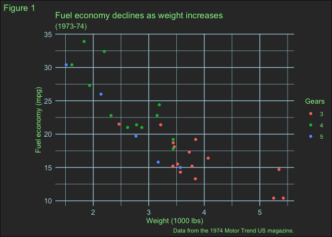

<!-- README.md is generated from README.Rmd. Please edit that file -->

# faker

<!-- badges: start -->
<!-- badges: end -->

A [Faker API](https://fakerapi.it/en) wrapper package in R.

Based on [`httr2`](https://httr2.r-lib.org) and built using the workflow
outlined in [R Packages](https://r-pkgs.org).

## Installation

You can install the development version of faker from
[GitHub](https://github.com/) with:

``` r
# install.packages("devtools")
devtools::install_github("judith-bourque/faker")
```

## Example

This is a basic example which shows you how to get a person using the
Faker API:

``` r
library(faker)

str(faker_person("male"))
#> List of 4
#>  $ status: chr "OK"
#>  $ code  : int 200
#>  $ total : int 1
#>  $ data  :List of 1
#>   ..$ :List of 10
#>   .. ..$ id       : int 1
#>   .. ..$ firstname: chr "Geo"
#>   .. ..$ lastname : chr "Harber"
#>   .. ..$ email    : chr "shannon.nader@hickle.com"
#>   .. ..$ phone    : chr "+4269718570645"
#>   .. ..$ birthday : chr "1985-04-17"
#>   .. ..$ gender   : chr "male"
#>   .. ..$ address  :List of 10
#>   .. .. ..$ id            : int 0
#>   .. .. ..$ street        : chr "10653 Hagenes Glens Suite 019"
#>   .. .. ..$ streetName    : chr "Rice Station"
#>   .. .. ..$ buildingNumber: chr "2989"
#>   .. .. ..$ city          : chr "Lake Allene"
#>   .. .. ..$ zipcode       : chr "06217"
#>   .. .. ..$ country       : chr "Oman"
#>   .. .. ..$ county_code   : chr "TN"
#>   .. .. ..$ latitude      : num -28.3
#>   .. .. ..$ longitude     : num -174
#>   .. ..$ website  : chr "http://gibson.com"
#>   .. ..$ image    : chr "http://placeimg.com/640/480/people"
```

This package includes a ggplot2 theme inspired by the Faker API:


